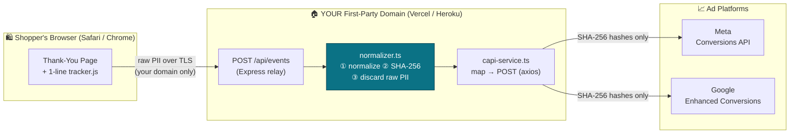

<div align="center">

# 🚀 OneClick CAPI Connector

### Fix Safari Tracking & Boost Your ROAS in 1‑Click

**Recover the 20–40% of conversions that Apple's ITP silently deletes — and feed clean, server‑side signal straight into Meta & Google.**

[](https://github.com/NagaYu/oneclick-capi-connector/actions/workflows/ci.yml)
[](#-license)
[](#-tech-stack)
[](#-zero-knowledge-architecture)
[](https://render.com/deploy?repo=https://github.com/NagaYu/oneclick-capi-connector)
[](#-quick-start-deploy-in-60-seconds)

</div>

---

## 📉 The Problem: Your Conversions Are Vanishing

Apple's **Intelligent Tracking Prevention (ITP)** caps client‑side cookies on Safari to **7 days — or 24 hours** for cookies set via URL parameters from ad clicks. Chrome is following with third‑party cookie deprecation. The result:

- The Meta Pixel and Google gtag fire in the browser, then **get blocked, throttled, or wiped** before the conversion is attributed.
- Your ad platforms **under‑report ROAS**, so their bidding algorithms optimize against *bad data*.
- You pay more per acquisition for **conversions you actually made** but can no longer prove.

Browser‑only tracking is no longer enough. The industry answer is **server‑side conversion tracking** — and that's exactly what this connector delivers.

## ✅ The Solution: A First‑Party, Server‑Side Relay

OneClick CAPI Connector is a lightweight relay you host on **your own domain**. A 1‑line snippet on your *Thank‑You* page sends the purchase to **your** server, which hashes the customer's PII in memory and forwards **only the SHA‑256 hashes** to:

- **Meta Conversions API (CAPI)**
- **Google Enhanced Conversions** (Google Ads API)

Because the signal originates **server‑to‑server from your first‑party domain**, ITP can't touch it. You get back the conversions you were losing — with **higher Event Match Quality** than the browser ever achieved.

---

## 🔐 Zero‑Knowledge Architecture

> **The customer's raw email and phone number never persist anywhere.** Not in a database, not in a log file, not even for a millisecond longer than the function call that hashes them. This is the line your CTO and legal team want to see.



**What leaves your server:** `8f434346…` (a hash). **What never leaves:** `customer@example.com`.

---

## ✨ Features

| | Feature | Why it matters |
|---|---|---|
| 🍪 | **ITP / cookieless‑proof** | Server‑side events bypass Safari's 7‑day & 24‑hour cookie caps. |
| 🔒 | **Zero‑knowledge PII handling** | Raw email/phone are hashed in memory and immediately discarded. |
| 🎯 | **100% match‑safe normalization** | Strict spec‑compliant cleansing (case, whitespace, full‑width → half‑width, country code) so hashes match the platform's — every time. |
| 🔁 | **Built‑in deduplication** | `event_id` is shared with the browser Pixel so Meta de‑dupes browser + server events. |
| 📦 | **Dual destination** | Meta CAPI **and** Google Enhanced Conversions from one event. |
| ⚡ | **1‑line install** | Drop a single `<script>` on your Thank‑You page. |
| 🛡️ | **CORS allow‑list + shared secret** | Locks the relay to your storefront; blocks open‑relay abuse. |
| 🧱 | **TypeScript `strict: true`** | Production‑grade type safety throughout. |

---

## 🧰 Tech Stack

- **Language:** TypeScript (Node.js ≥ 18.18), `strict: true`, `target: es2022`
- **Server:** Express
- **HTTP client:** Axios
- **Crypto:** Node.js built‑in `crypto` (SHA‑256) — no third‑party crypto deps
- **Config:** dotenv · **CORS:** cors

---

## 📁 Project Structure

```
.
├── package.json
├── tsconfig.json
├── .env.example
├── .gitignore
├── README.md
└── src
    ├── client
    │   └── tracker.ts        # 1-line browser snippet (compile → tracker.js)
    └── server
        ├── normalizer.ts     # strict normalization + SHA-256 (zero-knowledge)
        ├── capi-service.ts   # Meta CAPI + Google Enhanced Conversions dispatch
        └── index.ts          # Express relay: /api/events, /healthz
```

---

## 🚀 Quick Start — Deploy in 60 Seconds

### 1. Get the code & install

```bash
git clone https://github.com/NagaYu/oneclick-capi-connector.git
cd oneclick-capi-connector
npm install
```

### 2. Configure your secrets

```bash
cp .env.example .env
# Edit .env — at minimum set META_PIXEL_ID and META_ACCESS_TOKEN.
```

### 3. Run locally

```bash
npm run dev          # ts-node, hot path for development
# or
npm run build && npm start
```

Verify it's alive:

```bash
curl http://localhost:8080/healthz
# {"status":"ok","meta_enabled":true,"google_enabled":false,"time":"..."}
```

### 4. Deploy to the cloud (1‑click)

Each platform reads your `.env` values from its dashboard's environment‑variable settings.

**Render (recommended — runs the relay as a long‑lived process so the retry queue works fully)**

[](https://render.com/deploy?repo=https://github.com/NagaYu/oneclick-capi-connector)

1. Click the button above (or Render Dashboard → **New → Blueprint** → connect this repo). Render reads [`render.yaml`](render.yaml).
2. Set the secret env vars when prompted: **`META_PIXEL_ID`** and **`META_ACCESS_TOKEN`** (required), plus optional `ALLOWED_ORIGINS` and `RELAY_SHARED_SECRET`.
3. Click **Apply**. Render builds (`npm ci && npm run build`), starts (`npm start`), and health‑checks `/healthz`.

> ⚠️ Set `META_PIXEL_ID` and `META_ACCESS_TOKEN` to real values **before** the first deploy — the server fails fast at boot if a required credential is missing.

**Vercel**

```bash
npm i -g vercel
vercel            # follow prompts, then add env vars in the dashboard
vercel --prod
```

> *Want a literal button in your own fork's README?* Add:
> `[](https://vercel.com/new/clone?repository-url=https://github.com/NagaYu/oneclick-capi-connector)`

**Heroku**

```bash
heroku create your-capi-relay
heroku config:set META_PIXEL_ID=xxxx META_ACCESS_TOKEN=xxxx ALLOWED_ORIGINS=https://shop.example.com
git push heroku main
```

> *Button:* `[](https://heroku.com/deploy)`

### 5. Embed the 1‑line snippet on your Thank‑You page

First compile the client tracker to plain JS (served automatically at `/tracker.js`):

```bash
npm run build        # emits dist/client/tracker.js
```

Then, on your order‑confirmation page, inject the customer's order data into a single tag.

**Shopify** (`Settings → Checkout → Order status page` additional scripts — Liquid):

```html
<script
  src="https://your-capi-relay.vercel.app/tracker.js"
  data-endpoint="https://your-capi-relay.vercel.app/api/events"
  data-email="{{ customer.email }}"
  data-phone="{{ customer.phone }}"
  data-value="{{ checkout.total_price | money_without_currency }}"
  data-currency="{{ shop.currency }}"
  data-event-id="{{ checkout.order_id }}"
  defer></script>
```

**Custom / WooCommerce / headless** — call it programmatically:

```html
<script src="https://your-capi-relay.vercel.app/tracker.js" defer></script>
<script>
  window.addEventListener('load', function () {
    OneClickCAPI.trackPurchase(
      {
        email: 'customer@example.com',
        phone: '+81 90-1234-5678',
        value: 12800,
        currency: 'JPY',
        eventId: 'order_1001',   // share this exact id with your Pixel/gtag event
      },
      { endpoint: 'https://your-capi-relay.vercel.app/api/events' }
    );
  });
</script>
```

That's it. Open Meta **Events Manager → Test Events** (set `META_TEST_EVENT_CODE` in `.env`) and watch server‑side `Purchase` events arrive with a high Event Match Quality score. 🎉

---

## ⚙️ Configuration Parameters

| Variable | Required | Default | Description |
|---|:---:|---|---|
| `PORT` | — | `8080` | Port the relay listens on (auto‑set by Vercel/Heroku). |
| `ALLOWED_ORIGINS` | ⚠️ prod | *(empty)* | Comma‑separated CORS allow‑list of your storefront origins. Empty = permissive (dev only). |
| `RELAY_SHARED_SECRET` | optional | *(empty)* | When set, requests must send it as `X-Relay-Secret`. Blocks open‑relay abuse. |
| `PHONE_COUNTRY_CODE` | — | `81` | Country code (no `+`) prepended to national‑format numbers. |
| `REQUEST_TIMEOUT_MS` | — | `8000` | Upstream request timeout (ms). |
| `META_ENABLED` | — | `true` | Toggle Meta CAPI dispatch. |
| `META_PIXEL_ID` | ✅ if Meta on | — | Pixel / Dataset ID. |
| `META_ACCESS_TOKEN` | ✅ if Meta on | — | System‑user token with `ads_management`. |
| `META_TEST_EVENT_CODE` | optional | *(empty)* | Test Events code. **Leave empty in production.** |
| `META_API_VERSION` | — | `v21.0` | Graph API version. |
| `GOOGLE_ENABLED` | — | `false` | Toggle Google Enhanced Conversions dispatch. |
| `GOOGLE_ACCESS_TOKEN` | ✅ if Google on | — | OAuth2 Bearer access token. |
| `GOOGLE_DEVELOPER_TOKEN` | ✅ if Google on | — | Google Ads developer token. |
| `GOOGLE_CUSTOMER_ID` | ✅ if Google on | — | Target customer ID (digits only). |
| `GOOGLE_LOGIN_CUSTOMER_ID` | optional | *(empty)* | Manager/MCC login customer ID. |
| `GOOGLE_CONVERSION_ACTION_RESOURCE_NAME` | ✅ if Google on | — | `customers/{id}/conversionActions/{id}`. |
| `GOOGLE_API_VERSION` | — | `v17` | Google Ads API version. |

---

## 🧪 The Normalization Guarantee (Why Hashes Actually Match)

A single byte of difference between your normalization and the platform's makes the hash useless — the conversion is silently dropped. `normalizer.ts` follows the official Meta & Google specs **exactly**:

**Email** → full‑width→half‑width → `NFKC` → trim → lowercase
`"  Ｃustomer@Example.com "` → `customer@example.com` → `sha256` ✅

**Phone** → full‑width→half‑width → strip all non‑digits & `+` → leading `0` replaced with country code
`"090-1234-5678"` (JP) → `819012345678` → `sha256` ✅
*(Meta receives digits‑only; Google receives `+E.164` — each platform gets its own correct hash form.)*

---

## 🔌 API Reference

### `POST /api/events`

**Headers:** `Content-Type: application/json` · `X-Relay-Secret: <secret>` *(if configured)*

**Body:**

```json
{
  "event_name": "Purchase",
  "event_id": "order_1001",
  "event_time": 1719446400,
  "event_source_url": "https://shop.example.com/thank-you",
  "value": 12800,
  "currency": "JPY",
  "user_data": {
    "email": "customer@example.com",
    "phone": "+81 90-1234-5678",
    "fbp": "fb.1.1719446400.123",
    "fbc": "fb.1.1719446400.abc"
  }
}
```

**Response `200`:**

```json
{
  "ok": true,
  "event_id": "order_1001",
  "results": [
    { "platform": "meta",   "ok": true,  "skipped": false, "status": 200, "message": "Accepted by Meta Conversions API." },
    { "platform": "google", "ok": false, "skipped": true,  "status": null, "message": "Google dispatch disabled by configuration." }
  ]
}
```

Returns `400` (validation), `401` (bad secret), `502` (all active platforms failed), `500` (unexpected).

### `GET /healthz`

Liveness/readiness probe. Returns `{ status, meta_enabled, google_enabled, time }`. No PII.

---

## 🛟 Troubleshooting

- **Low Event Match Quality?** Make sure you pass `email` *and* `phone`, plus `fbp`/`fbc` (the tracker reads these cookies automatically).
- **Duplicate conversions?** Ensure the browser Pixel and this relay use the **same `event_id`**.
- **CORS error in console?** Add your storefront origin to `ALLOWED_ORIGINS`.
- **`401 Unauthorized`?** The `X-Relay-Secret` header must match `RELAY_SHARED_SECRET`.

---

## 🔏 Privacy & Compliance Notes

This connector is engineered to keep raw PII off your servers, but **you remain the data controller**. Ensure your privacy policy discloses server‑side conversion measurement, obtain the consent your jurisdiction requires (GDPR/ePrivacy, CCPA, APPI, etc.), and honor each ad platform's Business Tools / Customer Data terms.

---

## 📜 License

Released under the **MIT License** — commercial use, modification, and private use are all permitted. See [`LICENSE`](LICENSE).

```
MIT License — Copyright (c) 2026 OneClick CAPI Connector Contributors
Permission is hereby granted, free of charge, to any person obtaining a copy...
```

> Prefer copyleft? This codebase is equally compatible with **AGPL‑3.0** if you want to require downstream forks to share their source. Swap the `license` field in `package.json` and drop in the AGPL text.

---

<div align="center">

**Stop paying for conversions you can't prove. Deploy once, profit forever.**

Made with ☕ for performance marketers who refuse to lose data to Safari.

</div>
